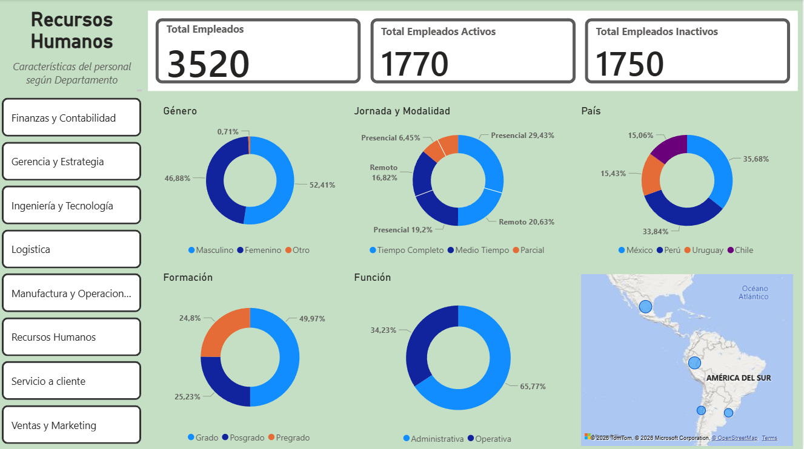

# Informe de empleados según Departamento en RRHH

# Explicación

La visualización destaca las características demográficas y laborales de los empleados de una empresa ficticia por departamento, además de aquellos en situación laboral activa o inactiva, pues los datos que ofrecen suponen de mención relevante. Del mismo modo, es posible segmentar los datos de los empleados por departamento.

Se ha obtenido la siguiente conclusión en función de los datos expuestos:

Hay una rotación global de empleados muy elevada. El personal inactivo total supone casi la mitad del total global (49.7%). Los departamentos con una rotación superior a la media (> 50%) son los siguientes: Finanzas y Contabilidad (53%), Servicio al Cliente (52%), Ventas y Marketing y Recursos Humanos (51% respectivamente). 

Es relevante actuar y revisar los protocolos de los departamentos administrativos, pues su función abarca un 65,77% del total de la empresa y todos los departamentos más afectados por la rotación pertenecen a ellos.

Del mismo modo, el número de empleadas femeninas inactivas totales supera a las activas totales. Es necesario revisar las causas y protocolos de actuación ante tal cifra.

Por otra parte, la modalidad remota tiene un mayor número de empleados inactivos sobre los activos totales. Una vez más, es preciso realizar una evaluación interna de las causas que podrían provocar este fenómeno.

La fuente de datos y patrones de visualización utilizados para este proyecto, han sido facilitados a través de un archivo .xlsx en OneDrive gracias a Guillermo Perdomo, creador de contenido de PowerBI en YouTube, en su canal "datdata".